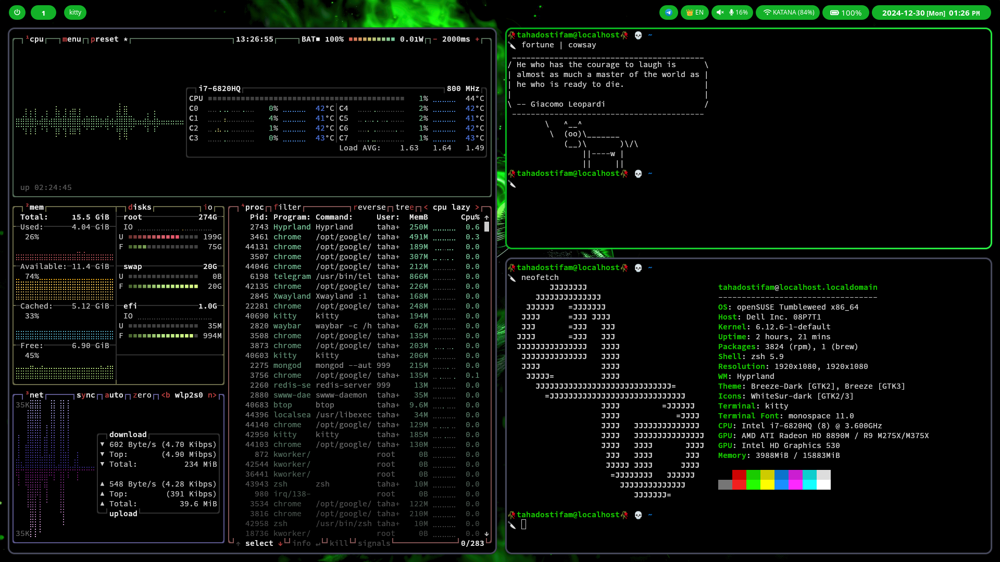

# Dark Green HyprLand Config

A meticulously crafted customization for the revolutionary Hyprland wayland compositor, designed to elevate your desktop experience. Dive into a world of streamlined aesthetics, intuitive workflows, and unparalleled performance.

### Screenshots




### Install

```bash
# Open Suse Tumblweed
sudo zypper in hyprland nwg-bar kitty nautilus wofi polkit-gnome xdg-desktop-portal-gnome hyprlock grim slurp swappy jq dunst libnotify swww pavucontrol jp2a fastfetch

git clone --depth=1 https://github.com/tahadostifam/Dark-Green-HyprLand-Config
cd Dark-Green-HyprLand-Config
sudo chmod +x ./scripts/*
./scripts/install.sh
```

### Optional

- Vscode Themes
  - <https://marketplace.visualstudio.com/items?itemName=magson.dark-hacker-theme>

### Contribution

Open to contribution on any part of the project! Create PR.🤌🏿🤌🏿
