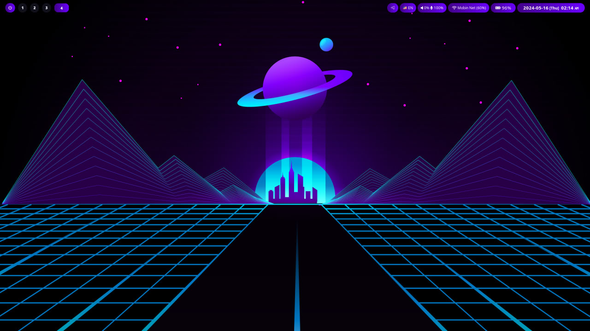

<div align="center">
    <a href="https://github.com/tahadostifam/Shalgam-Hypr-DE">
        
    </a>
    <h2>Shalgam!</h2>
</div>

<p>
Shalgam is a meticulously crafted customization for the revolutionary Hyprland window manager, designed to elevate your desktop experience. Dive into a world of streamlined aesthetics, intuitive workflows, and unparalleled performance.
</p>

### Install

```bash
git clone https://github.com/tahadostifam/Shalgam-Hypr-DE
cd Shalgam-Hypr-DE
sudo chmod +x ./scripts/*

./scripts/install.sh
```

### Optional

- Vscode Themes
  - <https://github.com/ahmadawais/shades-of-purple-vscode>

### Screenshots



### Keymaps

```txt
- Open Terminal (kitty)
SUPER + RETURN

- Open File Manager (nemo)
SUPER + E

- Quit current window
SUPER + Q

- Toggle Floating
SUPER + S

- App manager (wofi)
SUPER + R

- Power Menu (wifi4wofi)
SUPER + M

- Lock screen
SUPER + L

- Switch between workspaces
SUPER + 1
SUPER + 2
SUPER + 3

- Move window to another workspace
SUPER + SHIFT + 1
SUPER + SHIFT + 2
SUPER + SHIFT + 3
```

### Contribution

Open to contribution on any part of the project! Create PR.💜🦄
